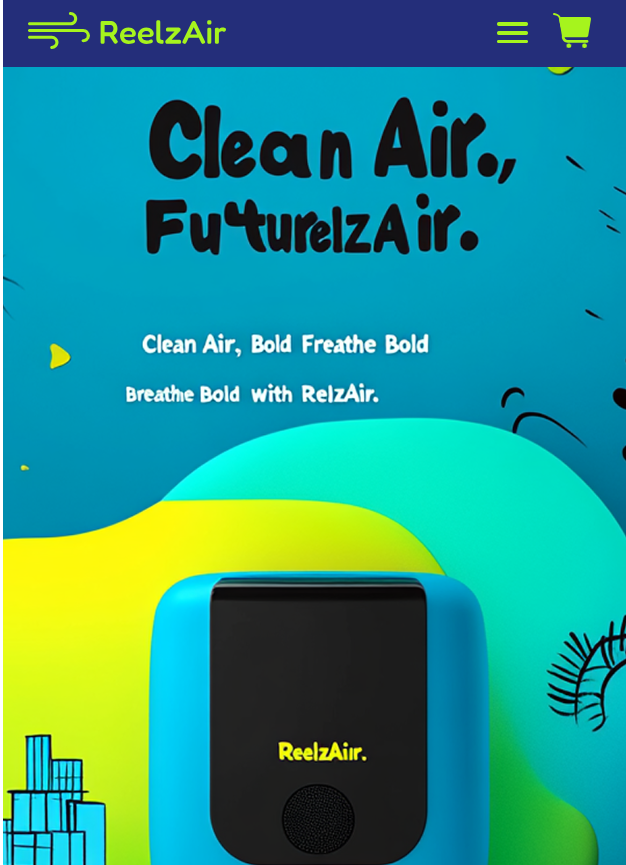
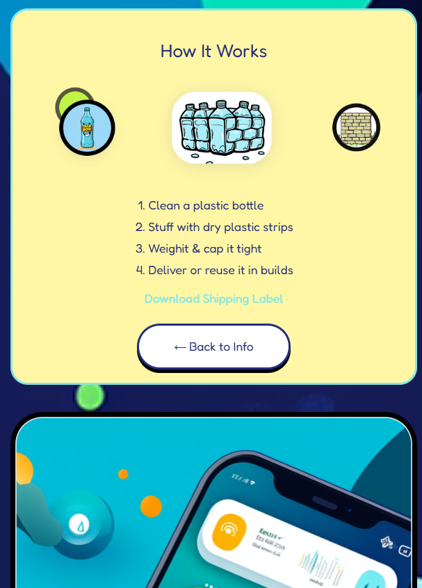
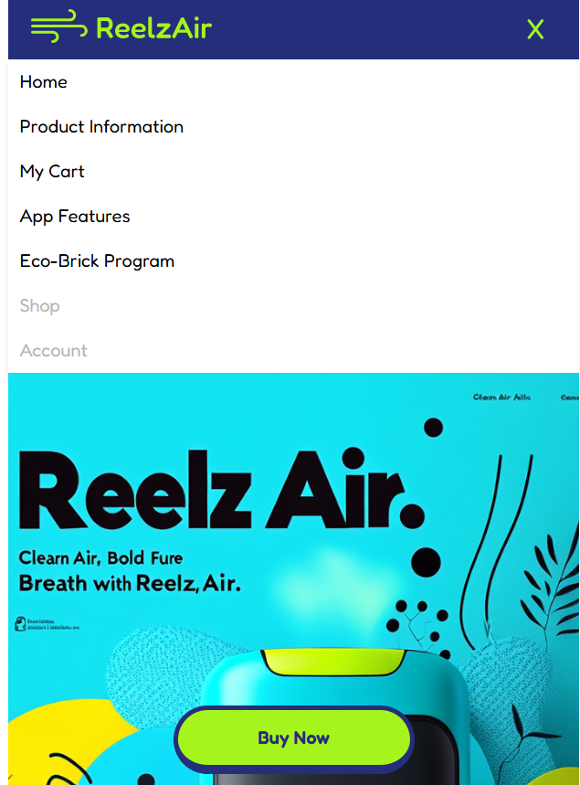
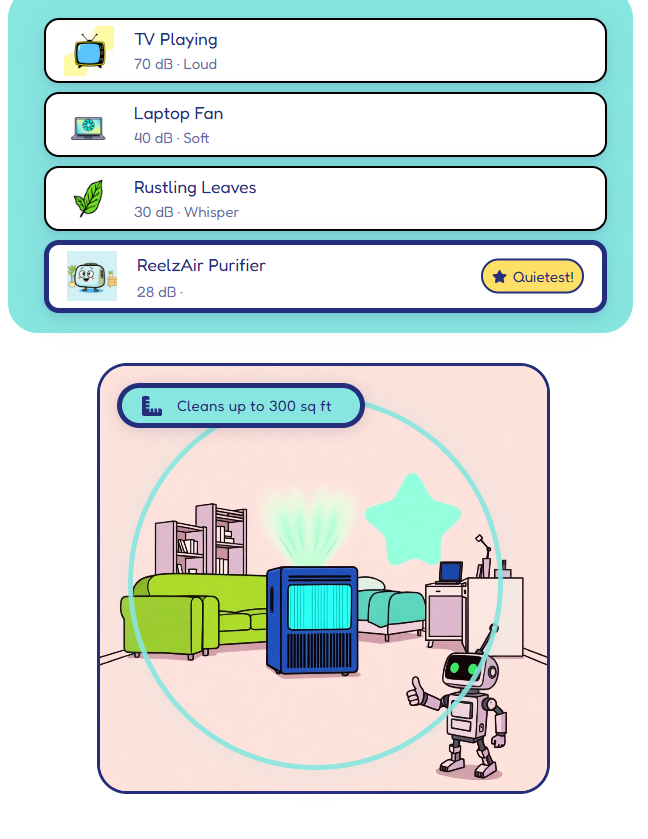
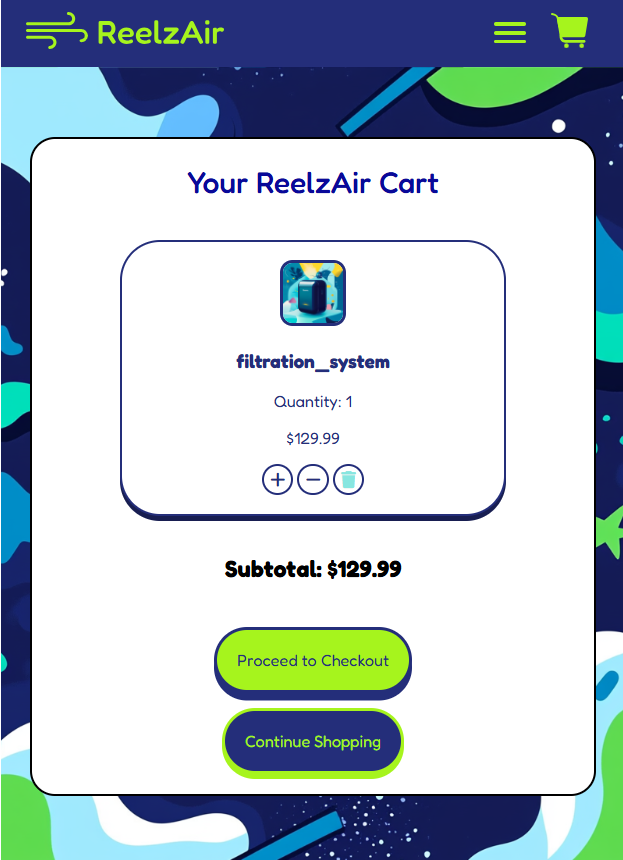

Reelzair is a sleek and responsive mobile web app that helps users browse, compare, and purchase premium air purifiers directly from their devices. Designed with simplicity, speed, and clean air in mind, Reelzair makes improving your environment effortless.

🚀 Features
🛍️ Shop Air Purifiers – View detailed specs, pricing, and reviews.

📱 Mobile-Optimized UI – Seamlessly responsive for all mobile devices.

🔍 Smart Search & Filters – Find the right purifier by size, brand, or features. --Stretch

💳 Secure Checkout – Purchase directly from the app via Stripe or other secure gateways. --Stretch

📦 Order Tracking – View current orders and delivery status (optional future feature). --Stretch

📸 Screenshots

🛠️ Built With

Frontend: Python

Backend: Django

Database: PostgreSQL

Payments: N/A

Deployment: Heroku

Note: We used a Python and Django Stack with PostgreSQL to build out the functionality of our application.

📦 Deployment
Reelzair is deployed via:

[Heroku](https://reelz-air-03741770c378.herokuapp.com/cart/)
